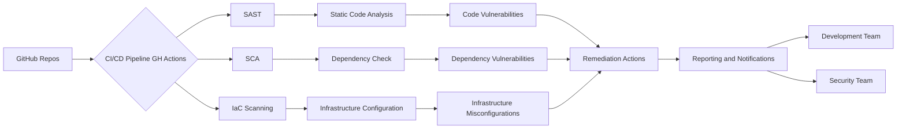

# DevSecOps Projects Overview
## Introduction
This security document outlines a DevSecOps project implementation incorporating Static Application Security Testing (SAST), Software Composition Analysis (SCA), and Infrastructure as Code (IaC) scanning best practices on applications running within AWS infrastrcuture, utilising GitHub Actions with workflows
## Project Goal
- Implement security measures throughout the software development lifecycle, creating a Secure Software Development Life Cycle (SSDLC).
- Automate security testing to identify vulnerabilities early in the development process, shifting security left.
- Integrate security into the CI/CD pipeline for continuous security monitoring.
- Ensure compliance with security best practices and industry standards.
- Enable PR blocking for Critical and High Vulnerabilities.
## Components
### 1. Infrastructure as Code (IaC) Scanning
IaC scanning ensures that the infrastructure configuration code adheres to security best practices and compliance standards. It helps in identifying misconfigurations and security loopholes in cloud infrastructure.
#### Tools:
- **Terraform Compliance**: Assesses Terraform scripts against security policies defined using BDD-style language to ensure compliance.
- **Trivy**: Provides automated IaC scanning to identify security misconfigurations across AWS, Azure, and GCP cloud environments.
### 2. Static Application Security Testing (SAST)
SAST involves analyzing the application's source code or binary code without executing it. This is done to identify security vulnerabilities, coding errors, and other issues in the codebase
#### Tools:
- **CodeQl**: Provides static code analysis to identify bugs, vulnerabilities, and code smells in various programming languages.
### 3. Software Composition Analysis (SCA)
SCA focuses on identifying and managing open-source components and third-party libraries used in the application. It helps in detecting known vulnerabilities in dependencies.
#### Tools:
- **Trivy**: Scans project dependencies and identifies vulnerabilities based on the National Vulnerability Database (NVD) and other sources.
1. **Integration with CI/CD Pipeline**: Incorporate SAST, SCA, and IaC scanning tools into the CI/CD pipeline to automate security testing.
2. **Pre-commit and Post-commit Hooks**: Implement pre-commit hooks to trigger security scans before code is merged into the main branch. Also, execute post-commit hooks to perform additional security checks after code deployment.
3. **Custom Policies**: Define custom security policies based on project requirements and industry standards to ensure comprehensive security coverage.
4. **Automated Remediation**: Configure automated remediation processes to fix identified vulnerabilities or misconfigurations whenever possible.
5. **Reporting and Notifications**: Generate detailed reports on security findings and send notifications to relevant stakeholders for prompt remediation.
## Conclusion
By integrating SAST, SCA, and IaC scanning practices into the DevSecOps pipeline, the project aims to enhance the security posture of the running applications in AWS, reducing vulnerabilities, and ensure compliance throughout the software development lifecycle.
# DevSecOps Project Diagram

# ⚠️ Security Notice
This repository contains intentionally vulnerable code examples for educational purposes. 
These vulnerabilities are used to demonstrate security scanning tools and DevSecOps practices.
DO NOT use this code in production environments.

## Purpose of Vulnerable Code
- The `app.py` file contains intentional implementations of OWASP Top 10 vulnerabilities
- These vulnerabilities demonstrate what security scanning tools can detect
- Each vulnerability is clearly commented to explain the security issue
- The code serves as a training resource for understanding common security flaws

## Security Scanning Demonstration
This project demonstrates three types of security scanning:
1. **SAST (Static Application Security Testing)** - Using CodeQL to find code vulnerabilities
2. **SCA (Software Composition Analysis)** - Using Trivy to scan dependencies
3. **IaC (Infrastructure as Code) Scanning** - Using Trivy to check infrastructure configurations

## Usage Notes
- All AWS resources referenced are examples only
- No actual infrastructure is deployed by default
- GitHub Action workflows are configured to use repository secrets for credentials
- This is a portfolio project demonstrating DevSecOps knowledge